<!-- Bloco sobre mim !-->
<h1> João Siqueira 👨‍💻</h1>

<h3> 🇧🇷 </h3>

**`Desenvolvedor FullStack`**

Sou João Victor Siqueira Migliorini, tenho 20 anos e atualmente curso Engenharia de Software na UNICIVE, após concluir o ensino médio no Colégio de Aplicação Pedagógica da UEM (CAP). Minha relação com a tecnologia começou ainda na infância, através dos jogos eletrônicos, foi jogando que nasceu minha curiosidade sobre como esses mundos eram construídos, o que mais tarde se transformou no desejo de aprender a criar os meus próprios. Hoje, venho desenvolvendo habilidades em diversas frentes: automações, criação de sites e projetos de pequeno e médio porte, adaptando-me com facilidade a diferentes linguagens de programação conforme o desafio exige. Estou em constante aprendizado, expandindo meu repertório técnico com novas linguagens e explorando o universo das automações com inteligência artificial, sempre buscando unir a paixão que me trouxe até aqui com a evolução contínua das tecnologias.

<h3> 🇺🇸 </h3>

**`Developer FullStack`**

I'm João Victor Siqueira Migliorini, 20 years old, currently studying Software Engineering at UNICICE after completing high school at Colégio de Aplicação Pedagógica da UEM (CAP). My relationship with technology started in childhood through video games. It was while playing that my curiosity about how those worlds were built first sparked, which later grew into a drive to learn how to create them myself. Today, I'm developing skills across several areas: automation, web development, and small to medium-sized projects, adapting easily to different programming languages as each challenge requires. I'm constantly learning, expanding my technical toolkit with new languages and exploring the world of AI-driven automation, always aiming to combine the passion that brought me here with the continuous evolution of technology.

---

<!-- Bloco de contato !-->
<h2> Contact Me On My Social Media 📲 </h2>

  <!-- INSTAGRAM !-->
  

  <!-- DISCORD !-->
  
  
  <!-- GMAIL !-->
  
  
  <!-- LINKEDIN !-->
  

---

<!-- Bloco dos status do meu GitHub !-->
<h2> My GitHub Stats 📊 </h2>

  
  
  
  
  

---

<!-- Bloco das minhas linguagens de programação dominate !-->

  
<h2> Programming Skills 💻 </h2>

  

---
<!-- Bloco do SVG criado por mim !-->

  <a>
    <h6> ▹ My Basic SVG Project Using HTML 🛣️</h6>
  </a>

<!-- PIXEL RUNNER !-->

---
